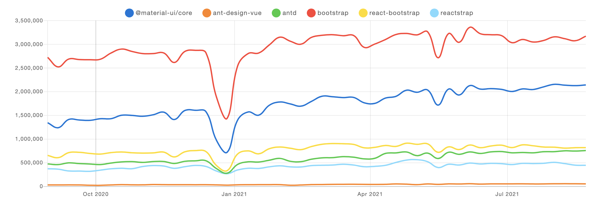

# antd 主题切换的实现原理

## 当前主流组件库主题切换实现方案？

- css 变量方案（简洁不兼容）：写多套存放主题变量的类，切换 html 上面的类名加载对应的主题样式 ([bootswatch](https://bootswatch.com/) )
- css-in-js 方案（复杂）：基于 pros 内传入的 theme 修改 js 中的样式 ([material](https://material-ui.com/zh/))
- less 编译方案（兼容简洁）：基于 less 和预先配置的主题变量生成多套主题样式，动态切换 css 资源 ([Antd](https://ant.design/components/overview-cn/))

## Antd 主题切换的实现原理

随着最近几年`Antd`组件库的茁壮发展，其在国内外的影响力也在逐渐扩大。目前其市场份额仅次于 bootStrap 成为全球第三受欢迎的 ui 组件库，甚至基于`Antd`风格实现的 vue 框架的组件库 `ant-design-vue` 也取得了很大的成功（作者已经全职开发维护该库），可以说`Antd`已经成为了国内前端 UI 组件库的半壁江山。


所以用好`Antd` 对于经常处理中后台业务的前端同学来说也显得尤为重要。

但是在使用`Antd` 的时候我一直不知道主题切换在项目中正确的使用方式，虽然在`Antd` 官网的文档和 `ant-design-pro` 都有主题切换的演示功能，但是在 `Antd` 的使用文档中这个功能却一笔带过，我想可能是这个功能的在实际项目中的使用确实还存在着一定的复杂度所有才没有过多的介绍。下面我将带着这个问题在`Antd` 的源码中找到其主题切换的答案。

### 1.Antd 的主题快速的切换是如何实现的呢？

首先我们先看下 `Antd` 官网在主题切换的时候做了什么？打开控制台检查`Button`组件可以发现如下 css 样式

**默认主题样式**


**暗黑主题样式**


动态加载预先编译打包出的主题样式文件，利用样式覆盖实现主题的切换功能

### 2.主题样式文件是如何生成的?

接下来介绍下一个包：`antd-pro-merge-less` 这个包就是用来生成其主题样式文件的.
其核心原理是**搜集**`Antd` 和 项目内所有的`less` 文件，并按照一定的顺序生成一个 `less` 文件的字符串，再通过 搜集`Antd` 内的所有的`less` 变量以及项目内的自定义变量生成的一份变量对象，再利用 `less.render` 方法生成一份 css 主题文件如`dark.css`。 最后可以通过 js 动态实现主题文件的加载实现样式覆盖


> **_注意：_**整个主题切换的核心是基于`less`实现，所有不管是项目内的自定义样式还是`Antd` 组件库的样式基本上只能借助`less` 去实现。

**antd-pro-merge-less 的使用**

```js
const genCss = require('antd-pro-merge-less');

genCss(
  path.join(__dirname, '..'),
  [
    {
      theme: 'dark',
      fileName: './_site/dark.css', // 写入暗黑色样式文件
      modifyVars: {
        ...defaultVar,
        ...dark,
        '@site-text-color': '@heading-color',
        '@site-markdown-code-bg': '@input-bg',
      },
    },
  ],
  {
    ignoreAntd: true,
    isModule: false,
    cache: false,
    loadAny: true,
    ignoreProLayout: true,
  },
);
```

1.获取所有 Antd less 文件

```js
const loadAntd = async (ignoreAntd, { dark = false, compact = false }) => {
  // 1. 默认不加载 antd 的文件，因为默认在ant-design内部搜集的是 components 内的less 文件
  if (ignoreAntd) {
    fs.writeFileSync(
      path.join(tempPath, './antd.less'),
      `@import '../color/bezierEasing';
      @import '../color/colorPalette';
      @import "../color/tinyColor";
          `,
    );
    return false;
  }

  // 2. 可以设置 ignoreAntd=true 使其在antd 包内搜集less 文件
  const ignoreFiles = [];
  const antdPath = require.resolve('antd');
  if (fs.existsSync(antdPath)) {
    await loopAllLess(
      path.resolve(path.join(antdPath, '../../es/')),
      ignoreFiles,
    ).then((content) => {
      fs.writeFileSync(
        path.join(tempPath, './antd.less'),
        `@import '../color/bezierEasing';
          @import '../color/colorPalette';
          @import "../color/tinyColor";
          ${content}
            `,
      );
    });
    return true;
  }
  return false;
};
```

2. 获取所有项目的 less 文件

```js
// 获取项目内所有 less 文件
const genProjectLess = (
  filePath,
  { isModule, loadAny, cache, ignoreAntd, ignoreProLayout, ...rest },
) =>
  genModuleLess(filePath, { isModule, ...rest }).then(async (content) => {
    if (cache === false) {
      rimraf.sync(tempPath);
    }
    if (!fs.existsSync(tempPath)) {
      fs.mkdirSync(tempPath);
    }

    const tempFilePath = winPath(path.join(tempPath, 'temp.less'));

    // 获取新旧文件的 hash
    const newFileHash = genHashCode(content);

    const oldFileHash = genHashCode(getOldFile(tempFilePath));
    if (newFileHash === oldFileHash) {
      isEqual = true;
      // 无需重复生成
      return false;
    }

    // 1. 把项目内所有的less文件搜集起来放入 temp.less
    fs.writeFileSync(tempFilePath, content);
    try {
      if (loadAny) {
        fs.writeFileSync(
          winPath(path.join(tempPath, 'pro.less')),

          // 2. components.less 表示其他的antd 扩展组件的less 文件合集
          `@import './components';  
           ${content}`,
        );
      } else {
        const lessContent = await getVariable(
          tempFilePath,
          fs.readFileSync(tempFilePath),
          loadAny,
        ).then((result) => result.content.toString());

        fs.writeFileSync(
          winPath(path.join(tempPath, 'pro.less')),
          `@import './components';
           ${lessContent}`,
        );
      }
    } catch (error) {
      console.log(error.name, error.file, `line: ${error.line}`);
    }
    await loadLibraryComponents(rest);

    return true;
  });
```

3. 主题样式生成

```js
const renderLess = async (
  theme = 'light',
  modifyVars,
  { min = true, ignoreAntd = false, disableExtendsDark = false },
) => {
  // 临时文件内的 pro.less 文件
  const proLess = winPath(path.join(tempPath, './pro.less'));
  if (!fs.existsSync(proLess)) {
    return '';
  }
  const myModifyVars = getModifyVars(
    theme || 'light',
    modifyVars,
    disableExtendsDark,
  );

  await loadAntd(ignoreAntd, {
    dark: myModifyVars.dark,
  });

  // 通过获取的项目内所有的less文件生成的字符串 和 less主题变量共同生成 主题的css代码
  return (
    less
      .render(fs.readFileSync(proLess, 'utf-8'), {
        modifyVars: myModifyVars,
        javascriptEnabled: true,
        filename: path.resolve(proLess),
      })
      // 如果需要压缩，再打开压缩功能默认打开
      .then((out) => (min ? uglifycss.processString(out.css) : out.css))
      .catch((e) => {
        console.log(e);
      })
  );
};
```

### related npm packages

[less-vars-to-js](https://www.npmjs.com/package/less-vars-to-js):从 less 文件中读取 less 变量生成一份 js 对象。
[uglifycss](https://github.com/fmarcia/uglifycss):css 代码压缩
[less-plugin-npm-import](https://github.com/less/less-plugin-npm-import)：添加了从 npm 包中导入 less 的能力
[tinycolor](https://github.com/bgrins/TinyColor):TinyColor 是一个小巧、快速的库，用于在 JavaScript 中进行颜色操作和转换。它允许多种形式的输入，同时提供颜色转换和其他颜色实用功能.
[theme-switcher](https://github.com/ycjcl868/theme-switcher#readme):动态主题切换
[antd-pro-merge-less](https://github.com/chenshuai2144/antd-pro-merge-less):这个插件会扫描 src 中所有的 less，并且将其合并为一个 ./temp/ant-design-pro.less
[@ant-design/pro-components](https://github.com/ant-design/pro-components):The Pro Series components are placed here to support heavy-duty components.

**参考：**
[Antd](https://github.com/ant-design/ant-design)
[Antd Pro 在线更换主题](https://pro.ant.design/zh-CN/blog/change-theme)
